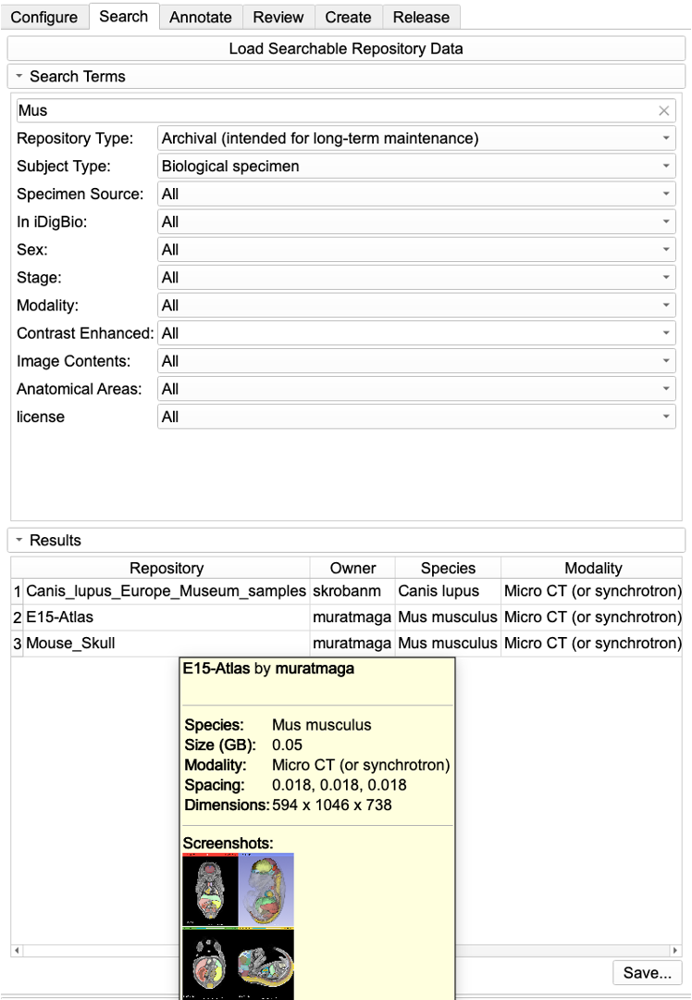

  

# MorphoDepot
A distributed, github based platform to share and collaborate on segmentation using open-source 3D Slicer biomedical image computing platform. 

The primary goal is to use github infrastructure to manage multi-person segmentation projects, particularly in context of classroom assignments.  A repository is used to manage segmentation of a specimen (e.g. a microCT of a fish) and issues are assigned to people to work on parts of the segmentation.  Pull requests are used to manage review and integration of segmentation tasks.

The Slicer extension uses git behind the scenes, but most of the project management is done from within Slicer.

## Module Description
MorphoDepot consisted of a single module with a tabbed workflow

* **Configure:** contains variables such as github username, path to the GH cli and git, as well as where the local repositories will be stored. User cannot proceed unless all fields are configured correctly.
* **Search:** Queries the github for currently existing MorphoDepot repositories and creates a summary table  Results can be filtered.
* **Annotate:** Primary interface the "segmenter" persona will interact with MorphoDepot. 
* **Review:** Primary interface the "owner" persona will interact with MorphoDepot
* **Create:** Interface to create a MorphoDepot repository from scratch
* **Release:** Interface to create a release of an existing repository and increment the version (not currently available)

## Prerequisites for using MorphoDepot
(First two and fifth steps are not required if you are planning to use [MorphoCloud On Demand Instances](https://morphocloud.org), which we highly encourage you to do so.)

1. Install [git command line tools for your operating system](https://git-scm.com/downloads). 
3. Install [GitHub CLI for your operating system.](https://cli.github.com/). 
4. Register an account on GitHub.com, if you don't already have one. 
5. On the computer you are planning to use the MorphoDepot, login to GitHub from the **terminal window** of your OS by giving this command: `gh auth login`. Make sure you follow the instructions all the way through, which involves the user pasting and 8-digit code (XXXX-YYYY) into the browser window, and authorizing GitHub. Make sure you have seen **"Congratulations, you're all set!"**, in your browser window (if not, you need to repeat the steps).
6. Install and start using the MorphoDepot Slicer extension. 

## MorphoDepot Personas
MorphoDepot workflows have two separate personas: **Repository Owner**, and **Individuals (aka segmenters or contributors)**. 

* **Repository owners** create the MorphoDepot repositories which consists of the scan data, the specific anatomical terminology to be used to describe the anatomical contents, and optionally a segmentation. They also need to complete the questionnaire about the specifics of the scan and specimen. 
* **Individuals** can be be anyone (e.g., students in a class, or a project team from a PI's lab). If they want to contribute to the project, or complete a class assignment, they need to open an issue on the specific repository they want to work on and get assigned to it by the Repository Owner. Then they can complete these assignments via MorphoDepot module in 3D Slicer.

## MorphoDepot Step-by-Step Tutorial
For more information about how to create and operate MorphoDepot repositories, please see our [step-by-step tutorial](https://github.com/SlicerMorph/Tutorials/tree/main/MorphoDepot)

## Funding 

MorphoDepot module is supported by funding from National Science Foundation ([DBI/2301405](https://www.nsf.gov/awardsearch/showAward?AWD_ID=2301405&HistoricalAwards=false)). 
