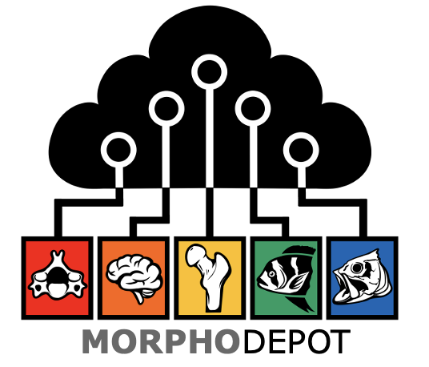

  

# MorphoDepot
A distributed, github based platform to share and collaborate on segmentation using open-source 3D Slicer biomedical image computing platform. 

The primary goal is to use github infrastructure to manage multi-person segmentation projects, particularly in context of classroom assignments.  A repository is used to manage segmentation of a specimen (e.g. a microCT of a fish) and issues are assigned to people to work on parts of the segmentation.  Pull requests are used to manage review and integration of segmentation tasks.

The Slicer extension uses git behind the scenes, but most of the project management is done from within Slicer.

|**MorphoDepot**|**MorphoDepotReview**|**MorphoDepotAccession**|
|-----|-----|----|
|lists pending issues assigned to this user and allows you to load/segment/commit them and then request review.|lists pending pull requests and allows the repository owner (PI) to accept edits or request changes.|allows generating github repositories that can be accessed via MorphoDepot module.|
||||
||||

## Prerequisites for MorphoDepot
(First two steps are not required if you are planning to use [MorphoCloud On Demand Instances](https://instances.morpho.cloud), which we highly encourage you to do so.)

1. Install [git command line tools for your operating system](https://git-scm.com/downloads). Make a note of the path you have installed git. You will need this information.
   * Most recent MacOS computers come with git half-way preinstalled. Open a terminal window and type `git`. This should bring a pop-up window that will ask you to install Command Line Tools. Accept and proceeed with the install. You can also install git through the mechanisms listed in the link above.  
3. Install [GitHub CLI for your operating system.](https://cli.github.com/). Make a note of the path you have installed gh. You will need this information.
4. Register an account on GitHub.com if you don't already have one. ([Note that GH now requires 2FA](https://docs.github.com/en/authentication/securing-your-account-with-two-factor-authentication-2fa/configuring-two-factor-authentication). For 2FA, we suggest using GitHub's mobile app).
5. Login to GitHub from the **terminal window** of your OS by giving this command: `gh auth login`. Make sure you follow the instructions all the way through, which involves the user pasting and 8-digit code (XXXX-YYYY) into the browser window, and authorizing GitHub. Make sure you have seen **"Congratulations, you're all set!"**, in your browser window (if not, you need to repeat the steps).
   * If you get an **"Command/file not found"** error, it means gh executable is not on your system path. You will need to provide the full path from step #2 as prefix to the command (e.g., `/Users/slicermorph/Desktop/gh-2.6/bin/gh auth login`)
6. Install the MorphoDepot Slicer extension. 

## Next Steps
Each MorphoDepot workflow have two separate personas: **Repository Owner**, and **Individuals (aka segmenters)**. 
* **Repository owners** provide the MorphoDepot repository (which contains the scan data and if there is any, available segmentation), the terminology to be used in the project, and optionally describe open tasks that needs to be completed.
* **Individuals** can be students in a class, or a project team from a PI's lab. Each one gets assigned a specific task by the Repository Owner, and obtain and complete these assignments via MorphoDepot module in 3D Slicer.

# Funding 

MorphoDepot module is supported by funding from National Science Foundation ([DBI/2301405](https://www.nsf.gov/awardsearch/showAward?AWD_ID=2301405&HistoricalAwards=false)). 
