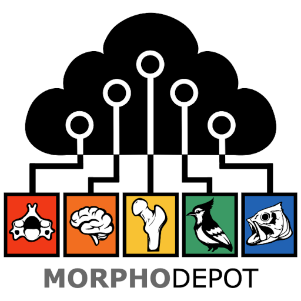

# MorphoDepot
A distributed, github based platform to share and collaborate on segmentation using open-source 3D Slicer biomedical image computing platform. 

The primary goal is to use github infrastructure to manage multi-person segmentation projects, particularly in context of classroom assignments.  A repository is used to manage segmentation of a specimen (e.g. a microCT of a fish) and issues are assigned to people to work on parts of the segmentation.  Pull requests are used to manage review and integration of segmentation tasks.

The Slicer extension uses git behind the scenes, but most of the project management is done from within Slicer.

* **MorphoDepot** module lists pending issues assigned to this user and allows you to load/segment/commit them and then request review.

* **MorphoDepotReview** module lists pending pull requests and allows the repository owner (PI) to accept edits or request changes.

* **MorphoDepotAccession** module allows generating github repositories that can be accessed via MorphoDepot module. 

## Preliminary requirements
(First two steps are not required if you are planning to use [MorphoCloud On Demand Instances](https://instances.morpho.cloud)

1. Install [git command line tools for your operating system](https://git-scm.com/downloads).
2. Install [GitHub CLI for your operating system.](https://cli.github.com/)
3. Register an account on GitHub.com if you don't already have one. ([Note that GH now requires 2FA](https://docs.github.com/en/authentication/securing-your-account-with-two-factor-authentication-2fa/configuring-two-factor-authentication), we suggest using its mobile app).
4. Login to GitHub from the command line using this tool command: `gh auth login`. This is a one-time setup (unless you log out from the github from the command line).
5. Install this SlicerMorphoDepot extension. 

## Next Steps
Each MorphoDepot workflow have two separate personas: **Repository Owner**, and **Individuals**. 
* **Repository owners** provide the MorphoDepot repository (which contains the scan data and if there is any, available segmentation), the terminology to be used in the project, and optionally describe open tasks that needs to be completed.
* **Individuals** can be students in a class, or a project team from a PI's lab. Each one gets assigned a specific task by the Repository Owner, and obtain and complete these assignments via MorphoDepot module in 3D Slicer.

[Follow this link for more documentation about how each persona interact with MorphoDepot and the tasks they are responsible for:](https://github.com/MorphoCloud/MorphoDepotDocs/blob/main/README.md)   

# Funding 

MorphoDepot module is supported by funding from National Science Foundation (DBI/2301405). 
